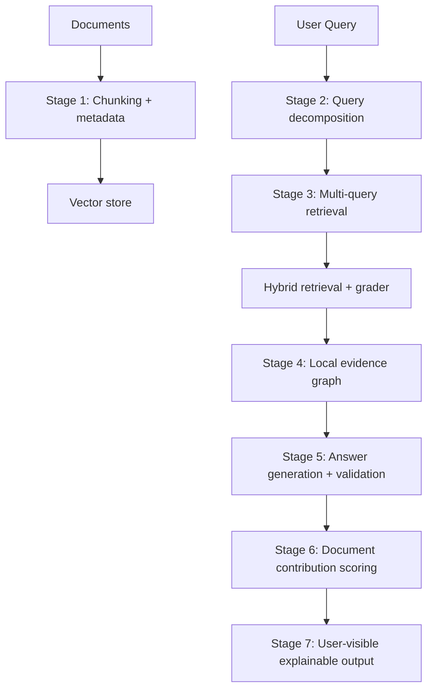

# Explainable RAG System (DataForge Pipeline)

[](https://www.python.org/)
[](https://fastapi.tiangolo.com/)
[](https://www.trychroma.com/)
[](https://ollama.ai/)
[](https://smith.langchain.com/)
[](#license)

An **explainable Retrieval-Augmented Generation (RAG)** pipeline designed to move from *"trust the model"* to *"here's the exact evidence and reasoning trace."*

This repo follows the pipeline described in **DataForge 2nd Round**: [DataForge_nikhil24380.pdf](DataForge_nikhil24380.pdf).

---

## Features

- **Local Embeddings** — Ollama + Qwen3-embedding:8b for high-quality 4096-dim embeddings (no API calls)
- **Domain Classification** — Local LLM (Ollama + Qwen2.5) automatically classifies chunks by knowledge domain
- **Entity & Relation Extraction** — SpaCy transformer model extracts entities and knowledge triples
- **Chunking with Metadata** — LangChain text splitters with rich metadata preservation
- **Vector Store** — ChromaDB persistent storage for embeddings
- **Observability** — Full LangSmith tracing for debugging and transparency
- **Explainable Output** — Evidence graphs, document contributions, and validation traces
- **Fully Local** — No external API dependencies for core functionality (OpenAI optional)

---

## Why this exists

Most RAG systems answer questions, but do not faithfully show:

- What knowledge was actually used
- Which retrieved sources contributed to the final answer
- Which sources were retrieved but unused (and why)
- How reasoning was structured from evidence

This project’s goal is to output:

1) A natural-language answer
2) A structured explanation in terms of **entities + relationships (triples)** derived directly from retrieved chunks

---

## Pipeline at a glance



---

## Stages (DataForge spec)

### Stage 1 — Data storage and chunking
Chunks are stored with **rich metadata** (topics, parent document id, key entities, etc.).
Embeddings are used for retrieval, while metadata remains stable so you can later explain:

- what got retrieved
- what got used
- what got ignored

### Stage 2 — Query decomposition
Break a complex user question into sub-queries and (optionally) tag them by domain.
This makes retrieval more robust and produces a visible “chain of queries”.

### Stage 3 — Multi-query retrieval (hybrid + graded)
Run retrieval per sub-query, keep results separated, then merge.

- Hybrid retrieval: vector + keyword to reduce false negatives
- Second-stage grader: filters/validates chunks and keeps logs for transparency

### Stage 4 — Local graph creation (evidence-only)
From retrieved chunks, extract:

- nodes: entities
- edges: relations

This produces a local “evidence graph” made only from retrieved text.

### Stage 5 — Answer generation and validation
Generate the answer using only:

- retrieved evidence chunks
- the local graph (nodes/edges)
- sub-queries

Then validate claims against the evidence graph, attach citations (chunk id + document id), and flag unsupported claims.

### Stage 6 — Document scoring and transparency
Quantify contribution per document:

$$
	ext{doc contribution} = \frac{\text{chunks used from doc}}{\text{total chunks retrieved from doc}}
$$

Documents below a threshold (or 0) are marked **retrieved but unused**.

### Stage 7 — User-visible explainable output
The response should include:

- sub-queries (and optionally domains)
- evidence list (document id, chunk id)
- extracted KG triples
- per-document contribution percentages
- unused documents (with explanation)
- the final answer plus a validation breakdown

---

## What's currently implemented

| Component | Status | Description |
|-----------|--------|-------------|
| **Chunking** | ✅ Done | `RecursiveCharacterTextSplitter` with configurable size/overlap |
| **Metadata Extraction** | ✅ Done | SpaCy `en_core_web_trf` for entities + Ollama Qwen2.5:7b for relation extraction |
| **Domain Classification** | ✅ Done | Ollama + Qwen2.5:7b local LLM classifier |
| **Embeddings** | ✅ Done | Ollama + Qwen3-embedding:8b (4096 dimensions) |
| **Vector Store** | ✅ Done | ChromaDB persistent client with collection management |
| **Pydantic Schemas** | ✅ Done | `ChunkRecord`, `ExtractedMetadata`, `Relation` models |
| **LangSmith Tracing** | ✅ Done | `@traceable` decorators on all pipeline functions |
| **Document Ingestion** | ✅ Done | Stage 1 full pipeline with PDF processing |
| **API Endpoints** | ✅ Done | FastAPI routes for `/ingest/`, `/query/`, `/query_decomposition/`, `/extract_entities/`, `/extract_relations/`, `/visualize_graph/` |
| **Query Decomposition** | ✅ Done | Stage 2 with Qwen2.5:7b breaking queries into ≤5 sub-queries |
| **Relation Extraction** | ✅ Done | LLM-based subject-predicate-object triple extraction |
| **Multi-Query Retrieval** | ✅ Done | Stage 3 vector retrieval with deduplication; hybrid search pending |
| **Evidence Graph** | ✅ Done | Stage 4 NetworkX-based knowledge graph from retrieved chunks |
| **Graph Visualization** | ✅ Done | Interactive 2D (PyVis) and 3D (Plotly) graph visualizations |
| **Answer Generation** | 🚧 Scaffold | Stage 5 placeholder |
| **Document Scoring** | 🚧 Scaffold | Stage 6 placeholder |

---

## Quickstart (Windows)

### 1) Create environment and install dependencies

```bash
python -m venv .venv
.venv\Scripts\activate
pip install -U pip
pip install -e .
```

### 2) Install SpaCy model

The metadata extractor requires the SpaCy transformer model:

```bash
python -m spacy download en_core_web_trf
```

### 3) Install Ollama and pull the required models

This project uses [Ollama](https://ollama.ai/) for local LLM inference. You need two models:
- **qwen3-embedding:8b** — For generating embeddings (4096 dimensions)
- **qwen2.5:7b** — For domain classification and text generation

#### Install Ollama

1. Download and install Ollama from [https://ollama.ai/download](https://ollama.ai/download)
2. After installation, Ollama should run automatically in the system tray (Windows)

#### Pull the required models

```bash
# Embedding model (required for vector search)
ollama pull qwen3-embedding:8b

# LLM for domain classification and generation
ollama pull qwen2.5:7b
```

#### Verify Ollama is running

```bash
# Check Ollama status and list available models
ollama list

# Expected output:
# NAME                  ID              SIZE
# qwen3-embedding:8b    64b933495768    4.7 GB
# qwen2.5:7b            845dbda0ea48    4.7 GB
```

#### Start Ollama server (if not running)

On Windows, Ollama typically runs in the background via the system tray. If it's not running:

```bash
# Option 1: Start from Windows Start menu / System tray

# Option 2: Start via command line
ollama serve
```

#### Test the connection

```bash
# Test API connectivity
curl http://localhost:11434/api/tags

# Or run the test script
python test_embed.py
```

> **Note:** The Ollama server must be running before starting the RAG system. The default endpoint is `http://localhost:11434`.

### 4) Configure environment variables

Create a `.env` file in the repo root:

```ini
# LangSmith tracing (optional but recommended)
LANGCHAIN_TRACING_V2=true
LANGCHAIN_API_KEY=your_langsmith_api_key
LANGCHAIN_PROJECT=explainable-rag

# OpenAI (optional, not required if using Ollama for everything)
OPENAI_API_KEY=your_openai_key

# Ollama configuration
OLLAMA_HOST=http://localhost:11434
OLLAMA_DOMAIN_MODEL=qwen2.5:7b
OLLAMA_EMBEDDING_MODEL=qwen3-embedding:8b
```

### 5) Run the API

```bash
uvicorn app.main:app --reload
```

### 6) Test metadata extraction

```bash
python test/entity_domainTest.py
```

Example output:
```
Entities: {'Jakob Bernoulli', '1713', 'the Law of Large Numbers'}
Relations: [Relation(subject='Jakob Bernoulli', predicate='introduce', object='Law')]
Domain: Mathematics
```

---

## API Endpoints

| Endpoint | Method | Description |
|----------|--------|-------------|
| `/api/v1/ingest/` | POST | Upload and process PDF documents |
| `/api/v1/query/` | POST | Full RAG pipeline (decompose → retrieve → respond) |
| `/api/v1/query_decomposition/` | POST | Break a query into sub-queries |
| `/api/v1/extract_entities/` | POST | Extract named entities from text |
| `/api/v1/extract_relations/` | POST | Extract subject-predicate-object triples |
| `/api/v1/visualize_graph/` | POST | Generate interactive knowledge graph visualizations |

Access the interactive API documentation at `http://localhost:8000/docs` after starting the server.

---

## Proposed API response shape (under iterations)

When the pipeline is wired end-to-end, a good response contract is:

```json
{
	"answer": "...",
	"sub_queries": ["..."],
	"domains_explored": ["..."],
	"evidence": [
		{
			"document_id": "doc-123",
			"chunk_id": "chunk-7",
			"text": "...",
			"score": 0.82
		}
	],
	"triples": [
		{"subject": "...", "predicate": "...", "object": "...", "chunk_id": "chunk-7"}
	],
	"document_contributions": [
		{"document_id": "doc-123", "contribution": 0.5}
	],
	"unused_documents": [
		{"document_id": "doc-999", "reason": "retrieved but no chunks used after grading/validation"}
	],
	"validation": {
		"supported_claims": 5,
		"unsupported_claims": 1,
		"flags": ["Claim 3 not supported by evidence graph"]
	}
}
```

---

## Project structure

```text
.
├─ app/
│  ├─ api/          # Endpoints & dependencies
│  │  ├─ endpoints.py        # API routes (/ingest, /query, /visualize_graph, etc.)
│  │  └─ dependencies.py     # FastAPI dependencies
│  ├─ core/         # Config & environment settings
│  │  └─ config.py           # Pydantic settings management
│  ├─ db/           # Database clients (ChromaDB)
│  │  └─ chroma_client.py    # ChromaDB singleton + embedding function
│  ├─ models/       # Pydantic schemas (ChunkRecord, Relation, etc.)
│  │  └─ schemas.py          # Data models for the pipeline
│  ├─ pipeline/     # Logic for Stages 1–6
│  │  ├─ chuncking.py            # Text splitting with LangChain
│  │  ├─ metadata.py             # Entity/relation/domain extraction
│  │  ├─ stage_1_ingestion.py    # Document ingestion pipeline
│  │  ├─ stage_2_decomposition.py # Query decomposition
│  │  ├─ stage_3_retrieval.py    # Multi-query vector retrieval
│  │  ├─ stage_4_local_graph.py  # Knowledge graph construction
│  │  ├─ stage_5_generation.py   # Answer generation (WIP)
│  │  └─ stage_6_scoring.py      # Document scoring (WIP)
│  ├─ utils/
│  │  ├─ llm.py              # Ollama LLM utilities (domain, entities, relations)
│  │  └─ visualizer.py       # 2D/3D graph visualization (PyVis + Plotly)
│  └─ main.py       # FastAPI entry point
├─ data/
│  ├─ chroma_storage/  # Persistent vector DB
│  └─ uploads/         # Uploaded documents
├─ lib/             # Frontend libraries (Vis.js, Tom Select)
├─ logs/            # Application logs
├─ test/            # Test files
├─ requirements.txt
└─ README.md
```

---

## Key Components

### Embeddings (`app/db/chroma_client.py`)

Uses Ollama with Qwen3-embedding:8b for local embedding generation:

```python
from app.db.chroma_client import get_embedding_function

embeddings = get_embedding_function(["Hello world", "Another text"])
# Returns: List of 4096-dimensional vectors
```

### Domain Classification (`app/utils/llm.py`)

Uses Ollama with Qwen2.5:7b to classify text into knowledge domains:

```python
from app.utils.llm import domain_classification

domain = domain_classification("Einstein developed the theory of relativity.")
# Returns: "Physics"
```

### Metadata Extraction (`app/pipeline/metadata.py`)

Extracts entities using SpaCy transformer model and relations using Ollama LLM:

```python
from app.pipeline.metadata import MetadataExtractor

extractor = MetadataExtractor()
meta = extractor.extract_metadata("Jakob Bernoulli introduced the Law of Large Numbers in 1713.")
# Returns: ExtractedMetadata(entities=[...], relations=[...], domain=["Mathematics"])
```

### Relation Extraction (`app/utils/llm.py`)

Uses Ollama with Qwen2.5:7b to extract subject-predicate-object triples:

```python
from app.utils.llm import extract_relations

relations = extract_relations("Einstein developed the theory of relativity.")
# Returns: [["Einstein", "developed", "theory of relativity"]]
```

### Chunking (`app/pipeline/chuncking.py`)

Splits documents into chunks with metadata preservation:

```python
from app.pipeline.chuncking import Chuncking

chunker = Chuncking(chunk_size=1000, chunk_overlap=100)
chunks = chunker.chunk_file(documents)
```

### Knowledge Graph (`app/pipeline/stage_4_local_graph.py`)

Builds a NetworkX graph from retrieved chunks with entities as nodes and relations as edges:

```python
from app.pipeline.stage_4_local_graph import KnowledgeGraphBuilder

graph_builder = KnowledgeGraphBuilder()
graph = graph_builder.build_graph(chunks)
context = graph_builder.get_relational_context()
# Returns formatted triples: "(Subject) --[predicate]--> (Object) [Ref: chunk_id]"
```

### Graph Visualization (`app/utils/visualizer.py`)

Creates interactive 2D (PyVis) and 3D (Plotly) visualizations:

```python
from app.utils.visualizer import GraphVisualizer

viz = GraphVisualizer(graph)
viz.prune_graph(min_edge_weight=1)
viz.generate_2d_html("graph_2d.html")  # Interactive PyVis graph
viz.generate_3d_html("graph_3d.html")  # 3D Plotly scatter plot
```

---

## Troubleshooting

### Ollama Connection Errors

If you see errors like:
```
ConnectionError: Failed to connect to Ollama
[WinError 10061] No connection could be made because the target machine actively refused it
```

**Solutions:**

1. **Check if Ollama is running:**
   ```bash
   ollama list
   ```
   If this fails, start Ollama from the system tray or run `ollama serve`

2. **Check the Ollama API:**
   ```bash
   curl http://localhost:11434/api/tags
   ```

3. **Verify models are downloaded:**
   ```bash
   ollama list
   # Should show qwen3-embedding:8b and qwen2.5:7b
   ```

4. **Re-pull models if needed:**
   ```bash
   ollama pull qwen3-embedding:8b
   ollama pull qwen2.5:7b
   ```

### SpaCy Model Errors

If you see errors about missing SpaCy models:
```bash
python -m spacy download en_core_web_trf
```

### ChromaDB Errors

If you encounter ChromaDB issues, try resetting the database:
```python
from app.db.chroma_client import ChromaClient
client = ChromaClient.get_instance()
client.reset()  # Warning: This deletes all data
```

---

## Roadmap

- [x] Chunking with metadata schema
- [x] Entity/relation extraction (SpaCy + Ollama)
- [x] Domain classification (Ollama local LLM)
- [x] ChromaDB vector store integration
- [x] LangSmith tracing
- [x] Wire ingestion pipeline end-to-end
- [x] Query decomposition (Stage 2)
- [x] Multi-query retrieval with deduplication (Stage 3)
- [x] Evidence graph construction (Stage 4 - NetworkX)
- [x] Interactive graph visualization (2D PyVis + 3D Plotly)
- [ ] Hybrid search (vector + keyword) for Stage 3
- [ ] Answer generation constrained to evidence (Stage 5)
- [ ] Document contribution scoring (Stage 6)
- [ ] UI dashboard for evidence inspection

---

## References

See [DataForge_nikhil24380.pdf](DataForge_nikhil24380.pdf) and these starting points:

- https://docs.langchain.com
- https://arxiv.org/abs/2312.10997

---

## License

MIT

