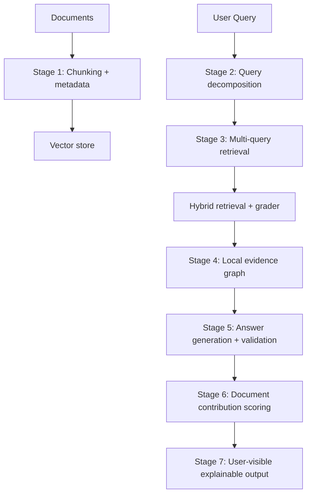

# Explainable RAG System (DataForge Pipeline)

[](https://www.python.org/)
[](https://fastapi.tiangolo.com/)
[](https://www.trychroma.com/)
[](https://ollama.ai/)
[](https://smith.langchain.com/)
[](#license)

An **explainable Retrieval-Augmented Generation (RAG)** pipeline designed to move from *"trust the model"* to *"here's the exact evidence and reasoning trace."*

This repo follows the pipeline described in **DataForge 2nd Round**: [DataForge_nikhil24380.pdf](DataForge_nikhil24380.pdf).

---

## Features

- **Domain Classification** — Local LLM (Ollama + Qwen2.5) automatically classifies chunks by knowledge domain
- **Entity & Relation Extraction** — SpaCy transformer model extracts entities and knowledge triples
- **Chunking with Metadata** — LangChain text splitters with rich metadata preservation
- **Vector Store** — ChromaDB persistent storage for embeddings
- **Observability** — Full LangSmith tracing for debugging and transparency
- **Explainable Output** — Evidence graphs, document contributions, and validation traces

---

## Why this exists

Most RAG systems answer questions, but do not faithfully show:

- What knowledge was actually used
- Which retrieved sources contributed to the final answer
- Which sources were retrieved but unused (and why)
- How reasoning was structured from evidence

This project’s goal is to output:

1) A natural-language answer
2) A structured explanation in terms of **entities + relationships (triples)** derived directly from retrieved chunks

---

## Pipeline at a glance



---

## Stages (DataForge spec)

### Stage 1 — Data storage and chunking
Chunks are stored with **rich metadata** (topics, parent document id, key entities, etc.).
Embeddings are used for retrieval, while metadata remains stable so you can later explain:

- what got retrieved
- what got used
- what got ignored

### Stage 2 — Query decomposition
Break a complex user question into sub-queries and (optionally) tag them by domain.
This makes retrieval more robust and produces a visible “chain of queries”.

### Stage 3 — Multi-query retrieval (hybrid + graded)
Run retrieval per sub-query, keep results separated, then merge.

- Hybrid retrieval: vector + keyword to reduce false negatives
- Second-stage grader: filters/validates chunks and keeps logs for transparency

### Stage 4 — Local graph creation (evidence-only)
From retrieved chunks, extract:

- nodes: entities
- edges: relations

This produces a local “evidence graph” made only from retrieved text.

### Stage 5 — Answer generation and validation
Generate the answer using only:

- retrieved evidence chunks
- the local graph (nodes/edges)
- sub-queries

Then validate claims against the evidence graph, attach citations (chunk id + document id), and flag unsupported claims.

### Stage 6 — Document scoring and transparency
Quantify contribution per document:

$$
	ext{doc contribution} = \frac{\text{chunks used from doc}}{\text{total chunks retrieved from doc}}
$$

Documents below a threshold (or 0) are marked **retrieved but unused**.

### Stage 7 — User-visible explainable output
The response should include:

- sub-queries (and optionally domains)
- evidence list (document id, chunk id)
- extracted KG triples
- per-document contribution percentages
- unused documents (with explanation)
- the final answer plus a validation breakdown

---

## What's currently implemented

| Component | Status | Description |
|-----------|--------|-------------|
| **Chunking** | ✅ Done | `RecursiveCharacterTextSplitter` with configurable size/overlap |
| **Metadata Extraction** | ✅ Done | SpaCy `en_core_web_trf` for entities + relation triples |
| **Domain Classification** | ✅ Done | Ollama + Qwen2.5:7b local LLM classifier |
| **Vector Store** | ✅ Done | ChromaDB persistent client with collection management |
| **Pydantic Schemas** | ✅ Done | `ChunkRecord`, `ExtractedMetadata`, `Relation` models |
| **LangSmith Tracing** | ✅ Done | `@traceable` decorators on all pipeline functions |
| **API Endpoints** | 🚧 Scaffold | FastAPI routes defined, wiring in progress |
| **Query Decomposition** | 🚧 Scaffold | Stage 2 placeholder |
| **Retrieval + Grading** | 🚧 Scaffold | Stage 3 placeholder |
| **Evidence Graph** | 🚧 Scaffold | Stage 4 placeholder |
| **Answer Generation** | 🚧 Scaffold | Stage 5 placeholder |
| **Document Scoring** | 🚧 Scaffold | Stage 6 placeholder |

---

## Quickstart (Windows)

### 1) Create environment and install dependencies

This repo includes `uv.lock`. If you use `uv`:

```bash
uv sync
```

If you prefer plain venv + pip:

```bash
python -m venv .venv
.venv\Scripts\activate
pip install -U pip
pip install -e .
```

### 2) Install SpaCy model

The metadata extractor requires the SpaCy transformer model:

```bash
python -m spacy download en_core_web_trf
```

### 3) Install Ollama and pull the model

Domain classification uses a local LLM via [Ollama](https://ollama.ai/):

```bash
# Install Ollama from https://ollama.ai/download
# Then pull the model:
ollama pull qwen2.5:7b
```

### 4) Configure environment variables

Create a `.env` file in the repo root:

```ini
# LangSmith tracing (optional but recommended)
LANGCHAIN_TRACING_V2=true
LANGCHAIN_API_KEY=your_langsmith_api_key
LANGCHAIN_PROJECT=explainable-rag

# OpenAI (for embeddings/generation, if used)
OPENAI_API_KEY=your_openai_key

# Ollama model override (optional, defaults to qwen2.5:7b)
OLLAMA_DOMAIN_MODEL=qwen2.5:7b
```

### 5) Run the API

```bash
uvicorn app.main:app --reload
```

### 6) Test metadata extraction

```bash
python entity_domainTest.py
```

Example output:
```
Entities: {'Jakob Bernoulli', '1713', 'the Law of Large Numbers'}
Relations: [Relation(subject='Jakob Bernoulli', predicate='introduce', object='Law')]
Domain: Mathematics
```

---

## Proposed API response shape (under iterations)

When the pipeline is wired end-to-end, a good response contract is:

```json
{
	"answer": "...",
	"sub_queries": ["..."],
	"domains_explored": ["..."],
	"evidence": [
		{
			"document_id": "doc-123",
			"chunk_id": "chunk-7",
			"text": "...",
			"score": 0.82
		}
	],
	"triples": [
		{"subject": "...", "predicate": "...", "object": "...", "chunk_id": "chunk-7"}
	],
	"document_contributions": [
		{"document_id": "doc-123", "contribution": 0.5}
	],
	"unused_documents": [
		{"document_id": "doc-999", "reason": "retrieved but no chunks used after grading/validation"}
	],
	"validation": {
		"supported_claims": 5,
		"unsupported_claims": 1,
		"flags": ["Claim 3 not supported by evidence graph"]
	}
}
```

---

## Project structure

```text
.
├─ app/
│  ├─ api/          # Endpoints & dependencies
│  ├─ core/         # Config & environment settings
│  ├─ db/           # Database clients (ChromaDB)
│  ├─ models/       # Pydantic schemas (ChunkRecord, Relation, etc.)
│  ├─ pipeline/     # Logic for Stages 1–7
│  │  ├─ chuncking.py         # Text splitting with LangChain
│  │  ├─ metadata.py          # Entity/relation extraction (SpaCy)
│  │  ├─ stage_1_ingestion.py # Document ingestion
│  │  ├─ stage_2_decomposition.py
│  │  ├─ stage_3_retrieval.py
│  │  ├─ stage_4_local_graph.py
│  │  ├─ stage_5_generation.py
│  │  ├─ stage_6_scoring.py
│  │  └─ orchestrator.py      # LangGraph pipeline orchestration
│  ├─ utils/
│  │  └─ llm.py     # Ollama domain classification
│  └─ main.py       # FastAPI entry point
├─ data/
│  ├─ chroma_storage/  # Persistent vector DB
│  └─ uploads/         # Uploaded documents
├─ logs/            # Application logs
├─ test/            # Test files
├─ pyproject.toml
├─ requirements.txt
└─ uv.lock
```

---

## Key Components

### Domain Classification (`app/utils/llm.py`)

Uses Ollama with Qwen2.5:7b to classify text into knowledge domains:

```python
from app.utils.llm import domain_classification

domain = domain_classification("Einstein developed the theory of relativity.")
# Returns: "Physics"
```

### Metadata Extraction (`app/pipeline/metadata.py`)

Extracts entities and relations using SpaCy transformer model:

```python
from app.pipeline.metadata import MetadataExtractor

extractor = MetadataExtractor()
meta = extractor.extract_metadata("Jakob Bernoulli introduced the Law of Large Numbers in 1713.")
# Returns: ExtractedMetadata(entities=[...], relations=[...], domain="Mathematics")
```

### Chunking (`app/pipeline/chuncking.py`)

Splits documents into chunks with metadata preservation:

```python
from app.pipeline.chuncking import Chuncking

chunker = Chuncking(chunk_size=1000, chunk_overlap=100)
chunks = chunker.chunk_file(documents)
```

---

## Roadmap

- [x] Chunking with metadata schema
- [x] Entity/relation extraction (SpaCy)
- [x] Domain classification (Ollama local LLM)
- [x] ChromaDB vector store integration
- [x] LangSmith tracing
- [ ] Wire ingestion pipeline end-to-end
- [ ] Multi-query decomposition + hybrid search
- [ ] Evidence graph construction (triples)
- [ ] Answer generation constrained to evidence
- [ ] Document contribution scoring
- [ ] UI dashboard for evidence inspection

---

## References

See [DataForge_nikhil24380.pdf](DataForge_nikhil24380.pdf) and these starting points:

- https://docs.langchain.com
- https://arxiv.org/abs/2312.10997

---

## License

TBD

